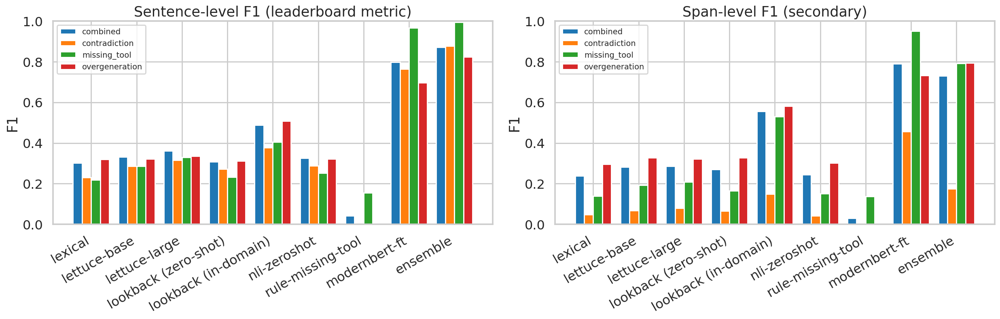

# halu-toolace

Span-level hallucination detection in tool-calling dialogues — full solution
to **"Hallucination Detection in Tool Calling"**

## Results



Sentence-level F1 on the published test split (the metric used for leaderboard ranking):

| method | combined | contradiction | missing_tool | overgeneration |
|---|---:|---:|---:|---:|
| lexical floor | 0.302 | 0.231 | 0.218 | 0.319 |
| LettuceDetect-base (PDF §2 baseline 1) | 0.331 | 0.286 | 0.287 | 0.321 |
| LettuceDetect-large (PDF §2 baseline 1) | 0.361 | 0.315 | 0.330 | 0.335 |
| LookBackLens zero-shot from RAGTruth (PDF §2 baseline 2) | 0.308 | 0.273 | 0.232 | 0.312 |
| LookBackLens in-domain on ToolACE | 0.489 | 0.377 | 0.406 | 0.508 |
| NLI zero-shot (DeBERTa-v3-large-mnli) | 0.326 | 0.288 | 0.252 | 0.322 |
| Rule-based missing_tool | 0.043 | 0.000 | 0.156 | 0.000 |
| **ModernBERT fine-tune** | **0.798** | **0.763** | **0.966** | **0.697** |
| **LightGBM ensemble** | **0.871** | **0.877** | **0.993** | **0.824** |

The strongest single model (ModernBERT fine-tune) improves the best baseline
sentence F1 by **+0.31 absolute** on `combined`; the ensemble adds another
+0.07. See `notebooks/improve_baselines.ipynb` for full code, training curves
and analysis.

## Repository layout

```
notebooks/
  data_pipeline.ipynb          dataset construction walkthrough
  lettucedetect_baseline.ipynb PDF §2 baseline 1 alone (kept for reference)
  lookbacklens_baseline.ipynb  PDF §2 baseline 2 alone (kept for reference)
  improve_baselines.ipynb      ← main notebook: §1–§11 covering both baselines
                                 + the four improvements + ensemble + analysis,
                                 fully self-contained (RUN_HEAVY flag)
  results/
    lettucedetect_baseline/    raw predictions for both LettuceDetect checkpoints
    lookbacklens_baseline/     Llama-2-7b attention features + 12 LookBackLens variants
    modernbert_ft/             fine-tuned ModernBERT checkpoint (1.5 GB) + log + metrics
    nli_zeroshot/              NLI predictions + metrics
    missing_tool_rule/         rule-based predictions + metrics
    ensemble/                  4 LightGBM models + predictions + feature importance
    baselines_resentence/      baselines re-scored at sentence + span level
src/data_processing/           dataset construction package (Stage 1, see PIPELINE.md)
docs/methods_comparison.png    bar chart above
PIPELINE.md                    Stage 1 architecture (dataset construction)
DATASET_CARD.md                README of the published HF dataset
```

## The main notebook

`notebooks/improve_baselines.ipynb` is the single source of truth for Stages
2 + 3 of the task:

```
Requirements
Data Loading
§1  LettuceDetect             — PDF baseline 1 (lexical + base + large)
§2  LookBackLens              — PDF baseline 2 (Llama-2-7b + LR, all code inlined)
§3  ModernBERT fine-tune      — improvement 1, with training curves
§4  NLI zero-shot             — improvement 2
§5  Rule-based missing_tool   — improvement 3
§6  LightGBM ensemble         — improvement 4
§7  Final results table + cross-method bar plot
§8  Per-corruption-type breakdown on combined
§9  Qualitative inspection (HTML highlight of TP / FP / FN)
§10 Ensemble feature importance
§11 Discussion
```

Every training/inference loop is inlined as a code cell. A `RUN_HEAVY = False`
flag at the top of the Requirements cell skips heavy computation by default
and downstream cells load the persisted artifacts from `notebooks/results/`,
so opening the notebook gives all tables and plots in seconds. Flip the flag
and restart to reproduce every artifact from scratch (~50 min on one H200).

## Dataset (Stage 1)

Built upstream from ToolACE via the `src/data_processing/` package:

- **Dataset on Hugging Face:** [`Ivan1008/toolace-hallucination-spans`](https://huggingface.co/datasets/Ivan1008/toolace-hallucination-spans)
- **Trained model on Hugging Face:** [`ArsenyIvanov/toolace-halu-modernbert-large`](https://huggingface.co/ArsenyIvanov/toolace-halu-modernbert-large)
- **Schema:** RAGTruth-compatible (`query`, `context`, `output`, `hallucination_labels`)
- **Configs:** `combined`, `contradiction`, `missing_tool`, `overgeneration`
- Build, validate, audit, recover, merge, push — see `PIPELINE.md` and the
  walk-through in `notebooks/data_pipeline.ipynb`.

```bash
uv venv --python 3.11 .venv
uv pip install --python .venv/bin/python -r requirements.txt

python -m src.data_processing.build_from_toolace
python -m src.data_processing.validate_spans --allow-clean data/combined/*.jsonl
python -m src.data_processing.zero_shot_eval --dataset-dir data/combined --split validation

python -m src.data_processing.audit run --backend openrouter --split train
python -m src.data_processing.recover cleans \
    --decisions data/quality_audit_openrouter/combined/train/decisions.jsonl \
    --source data/combined/train.jsonl --out-dir data/recovered --split train
python -m src.data_processing.recover extra-spans
python -m src.data_processing.recover other

python -m src.data_processing.merge_final
python -m src.data_processing.push_to_hub <user>/<repo> --readme DATASET_CARD.md
```

## Reproducing the experiments

```bash
# 1. install runtime dependencies (one-time)
uv venv --python 3.11 .venv
uv pip install --python .venv/bin/python -r requirements.txt \
    lightgbm peft accelerate sentence-transformers jupyter ipykernel scikit-learn

# 2. open the notebook (no recomputation)
.venv/bin/jupyter lab notebooks/improve_baselines.ipynb

# 3. (optional) full retraining
#    edit Requirements cell: RUN_HEAVY = True   then restart kernel and run all
```

## Checkpoints

| Checkpoint | Location | Loader |
|---|---|---|
| ModernBERT fine-tune (token classifier, 7 BIO classes) | HF: [`ArsenyIvanov/toolace-halu-modernbert-large`](https://huggingface.co/ArsenyIvanov/toolace-halu-modernbert-large) — or local `notebooks/results/modernbert_ft/checkpoint_final/` (1.5 GB, gitignored) | `AutoModelForTokenClassification.from_pretrained("ArsenyIvanov/toolace-halu-modernbert-large")` |
| LightGBM ensemble (4 per-config models) | `notebooks/results/ensemble/lgbm_<cfg>.txt` (~1.6 MB total) | `lgb.Booster(model_file=...)` |
| LookBackLens attention feature cache | `notebooks/results/lookbacklens_baseline/features/*.npz` (~2.4 GB) | `np.load(...)` (used by §2 to skip Llama-2 re-extraction) |

External pretrained models pulled from HF at runtime (when `RUN_HEAVY=True`):
`KRLabsOrg/lettucedect-{base,large}-modernbert-en-v1`,
`NousResearch/Llama-2-7b-chat-hf`,
`MoritzLaurer/DeBERTa-v3-large-mnli-fever-anli-ling-wanli`,
`sentence-transformers/all-MiniLM-L6-v2`.

## Team project

Elizaveta Kamenskaya <br>
Ivan Listopadov <br>
Arseny Ivanov <br>
Maxim Smirnov

## License

Apache 2.0 (matches `minpeter/toolace-parsed`).
